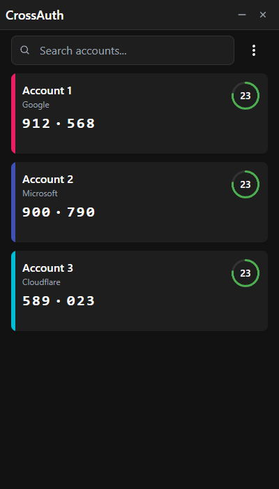
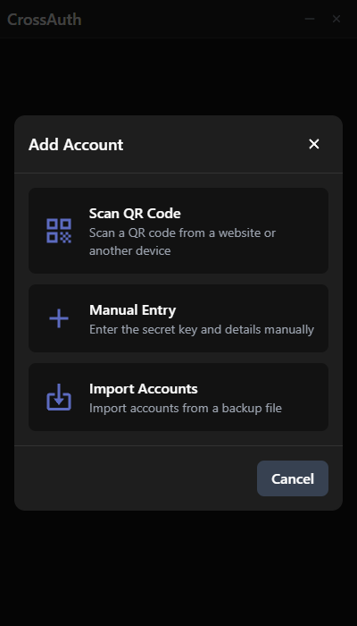

# CrossAuth

<p align="center">
  
</p>

<p align="center">
  A secure, cross-platform authenticator app for managing your two-factor authentication codes
</p>

<p align="center">
  
  
  
</p>

## 🔐 Features

- **Secure Storage**: All your authenticator tokens are encrypted with AES-256
- **Password Protection**: Set a master password to secure your account data
- **Streamer Mode**: Hide your codes when streaming or screen sharing
- **Cross-Platform**: Available for Windows, macOS, and Linux
- **Intuitive UI**: Clean, modern interface with dark mode
- **QR Code Scanning**: Quickly add accounts by scanning QR codes
- **Backup & Restore**: Export and import your accounts securely
- **Google Authenticator Import**: Support for Google Authenticator export QR codes

## 📥 Installation

### Windows

1. Download the latest `.exe` installer from the [Releases](https://github.com/PicoShot/CrossAuth/releases) page
2. Run the installer and you good to go

### macOS

1. First you need to compile it yourself
2. Open the DMG file and drag the app to your Applications folder

### Linux

1. First you need to compile it yourself
2. Install using your system's package manager or run the AppImage

## 🖼️ Screenshots

<div align="center">
  
  
</div>

## 🚀 Getting Started

### Adding Your First Account

1. Launch CrossAuth
2. Click the menu button in the top-right corner
3. Select "Scan QR Code" or "Manual Entry"
4. If scanning, point your camera at the QR code provided by the service
5. If entering manually, enter the secret key and account details
6. Your new account will appear in the main view with a generated authentication code

### Setting a Password

For additional security, you can set a master password:

1. Click the menu button in the top-right corner
2. Select "Settings"
3. In the Security section, click "Set" next to Password Protection
4. Enter and confirm your password
5. Click "Set Password"

## 🛠️ Development

### Prerequisites

- Rust
- Node.js
- pnpm

### Setup

```bash
# Clone the repository
git clone https://github.com/PicoShot/CrossAuth.git
cd CrossAuth

# Install dependencies
pnpm install

# Start the development server
pnpm tauri dev

# Build for production
pnpm tauri build
```

## 🔒 Security

CrossAuth takes your security seriously:

- All account data is encrypted using AES-256 encryption
- Your master password is never stored directly but used as an encryption key
- The app runs locally on your computer - your authentication tokens never leave your device
- Auto-lock feature can lock the app after a period of inactivity

## 🤝 Contributing

Contributions are welcome! Please feel free to submit a Pull Request.


## 📝 License

This project is licensed under the MIT License - see the [LICENSE](LICENSE) file for details.

## 🙏 Acknowledgements

- [Tauri](https://tauri.app/) - Cross-platform desktop framework
- [React](https://reactjs.org/) - UI library
- [Framer Motion](https://www.framer.com/motion/) - Animation library
- [Tailwind CSS](https://tailwindcss.com/) - CSS framework
- [otpauth](https://github.com/hectorm/otpauth) - TOTP/HOTP implementation

---

<p align="center">
  Made with ❤️ by PicoShot
</p>
